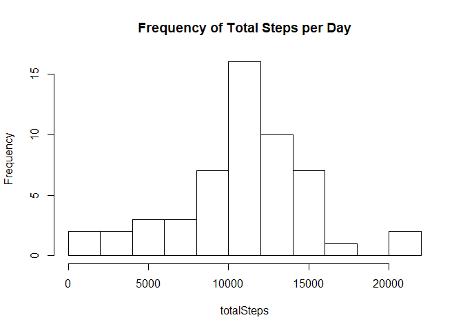
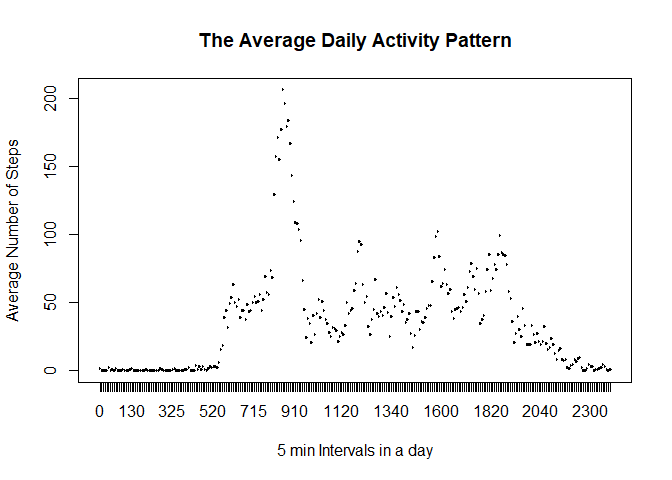
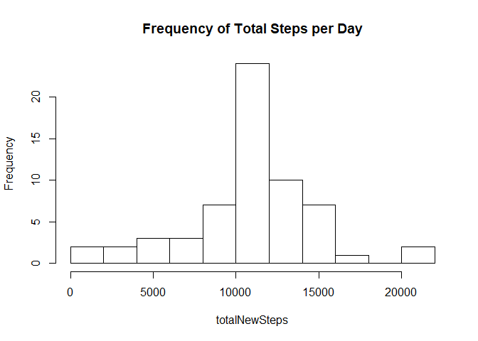
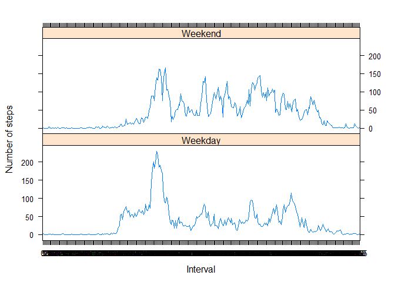

#Reproducible Research - Peer Assessement 1
==========================================
This assignment makes use of data from a personal activity monitoring device. This device collects data at 5 minute intervals through out the day. The data consists of two months of data from an anonymous individual collected during the months of October
and November, 2012 and include the number of steps taken in 5 minute intervals each day.

### The data
The variables included in this dataset are:

- steps: Number of steps taking in a 5-minute interval (missing values are coded as NA);
- date: The date on which the measurement was taken in YYYY-MM-DD format;
- interval: Identifier for the 5-minute interval in which measurement was taken.
The dataset is stored in a comma-separated-value (CSV) file and there are a total of 17,568 observations in this dataset.


## Loading and Processing the data
This following code reads the data into R and transform the data into a format suitable for the analysis (use factors and adapt the date format).


```r
unzip("activity.zip")
activity <- read.csv("./activity.csv")
activity$interval <- as.factor(activity$interval)
activity$date <- as.Date(activity$date)
```


## What is the mean total number of steps taken per day?
This part calculates the total number of steps taken per day and turns it into a histogram. Then, it calculates the mean and the median of the total number of steps tken per day.

1 Calculate the total number of steps taken per day

```r
activityomit <- as.data.frame(activity[complete.cases(activity), ])
totalSteps <- tapply(activityomit$steps, activityomit$date, sum)
totalSteps
```

```
## 2012-10-02 2012-10-03 2012-10-04 2012-10-05 2012-10-06 2012-10-07 2012-10-09 
##        126      11352      12116      13294      15420      11015      12811 
## 2012-10-10 2012-10-11 2012-10-12 2012-10-13 2012-10-14 2012-10-15 2012-10-16 
##       9900      10304      17382      12426      15098      10139      15084 
## 2012-10-17 2012-10-18 2012-10-19 2012-10-20 2012-10-21 2012-10-22 2012-10-23 
##      13452      10056      11829      10395       8821      13460       8918 
## 2012-10-24 2012-10-25 2012-10-26 2012-10-27 2012-10-28 2012-10-29 2012-10-30 
##       8355       2492       6778      10119      11458       5018       9819 
## 2012-10-31 2012-11-02 2012-11-03 2012-11-05 2012-11-06 2012-11-07 2012-11-08 
##      15414      10600      10571      10439       8334      12883       3219 
## 2012-11-11 2012-11-12 2012-11-13 2012-11-15 2012-11-16 2012-11-17 2012-11-18 
##      12608      10765       7336         41       5441      14339      15110 
## 2012-11-19 2012-11-20 2012-11-21 2012-11-22 2012-11-23 2012-11-24 2012-11-25 
##       8841       4472      12787      20427      21194      14478      11834 
## 2012-11-26 2012-11-27 2012-11-28 2012-11-29 
##      11162      13646      10183       7047
```

2 Make an histogram of the total number of steps taken each day

```r
hist(totalSteps,nrow(totalSteps), breaks = 10, main = "Frequency of Total Steps per Day")
```

<!-- -->

3 Calculate and report the mean and median of the total number of steps taken per day

```r
meanActivity <- mean(totalSteps)
medianActivity <- median(totalSteps)
```

The **mean** of the total number of steps taken per day is 1.0766189\times 10^{4}.
The **median** of the total number of steps taken per day is 10765.


## What is the average daily pattern?
The following code plots the average number of steps in each interval across all days, as well as the "busiest" (max) interval.

1 Make a time series plot of the 5-minute interval ans the average number of steps taken, averaged accross all days.

```r
dailyPattern <- aggregate(activityomit$steps, by = list(activityomit$interval), FUN = mean)
plot(dailyPattern, type = "l", 
     xlab = "5 min Intervals in a day", 
     ylab = "Average Number of Steps", 
     main = "The Average Daily Activity Pattern")
```

<!-- -->

2 Which 5-minute interval, on average accross all the days in the dataset, contains the maximum number of steps?

```r
maxInterval <- dailyPattern[which.max(dailyPattern[, 2]), 1]
```

The 5-minute interval that contains the maximum number of steps is the interval 835.


## Imputing missing values
This part has been created to underline possible bias into some calculations and summaries intoduced by the presence of missing values.

1 Calculate and report the total number of missing values in the data set.

```r
countNA <- sum(!complete.cases(activity))
```

There are 2304rows with missing values in this dataset.


2 Devise a strategy for filling in all of the missing values in the dataset. 

The strategy we chose to impute missing values is to use the mean for the 5-minute interval.
To do so, we create a new dataset equal to the original data. However, the missing values are replaced by the corresponding 5-minute interval mean (see strategy above).


3 Create a new data set that is equal to the original dataset but with the missing values filled.

```r
newActivity <- activity
len1 <- nrow(newActivity)
len2 <- nrow(dailyPattern)
for (i in 1:len1) {
  if (is.na(newActivity$steps[i])) {
    for (j in 1:len2) {
      if (newActivity$interval[i] == dailyPattern[j, 1]) {
        newActivity$steps[i] = dailyPattern[j, 2]
      }
    } 
  }    
}
head(newActivity)
```

```
##       steps       date interval
## 1 1.7169811 2012-10-01        0
## 2 0.3396226 2012-10-01        5
## 3 0.1320755 2012-10-01       10
## 4 0.1509434 2012-10-01       15
## 5 0.0754717 2012-10-01       20
## 6 2.0943396 2012-10-01       25
```


4 Make a histogram of the total number of steps taken each day and calculate and report the mean and median total number of steps taken per day.

```r
totalNewSteps <- tapply(newActivity$steps, newActivity$date, sum)
hist(totalNewSteps,nrow(totalNewSteps), breaks = 10, main = "Frequency of Total Steps per Day")
```

<!-- -->

```r
meanNewSteps <- mean(totalNewSteps, na.rm = TRUE)
medianNewSteps <- median(totalNewSteps, na.rm = TRUE)
```

With our new strategy, the **mean** of the total number of steps taken per day is 1.0766189\times 10^{4}, while our last mesurement was 1.0766189\times 10^{4}.
With our new strategy, the **median** of the total number of steps taken per day is 1.0766189\times 10^{4}, while our last measurement was 10765.
The mean in this data set is the same as the mean in the original data set, while the median differs slightly (and is equal to the mean). This impact is simply because that we add the 2304 values with the mean of the 5-minute interval from the original dataset. As a resullt, the mean does not change, and the median moves towards to the mean value.


## Are there differences in activity patterns between weekdays and weekends?

1 Create a new factor variable in the dataset with two levels – “weekday” and “weekend” indicating whether a given date is a weekday or weekend day.

```r
day <- weekdays(as.Date(newActivity$date))
daylevel <- vector()
for (i in 1:nrow(newActivity)) {
    if (day[i] == "samedi") {
        daylevel[i] <- "Weekend"
    } else if (day[i] == "dimanche") {
        daylevel[i] <- "Weekend"
    } else {
        daylevel[i] <- "Weekday"
    }
}
newActivity$daylevel <- daylevel
newActivity$daylevel <- factor(newActivity$daylevel)
stepsByDay <- aggregate(steps ~ interval + daylevel, data = newActivity, mean)
names(stepsByDay) <- c("interval", "daylevel", "steps")
```

2 Make a panel plot containing a time series plot of the 5-minute interval (x-axis) and the average number of steps taken, averaged across all weekday days or weekend days (y-axis).

```r
library("lattice")
xyplot(steps ~ interval | daylevel, stepsByDay, type = "l", layout = c(1, 2), 
    xlab = "Interval", ylab = "Number of steps")
```

<!-- -->


